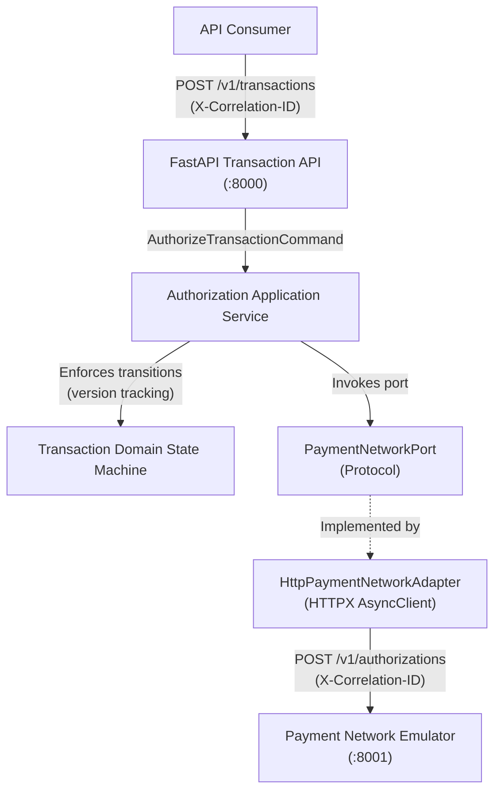
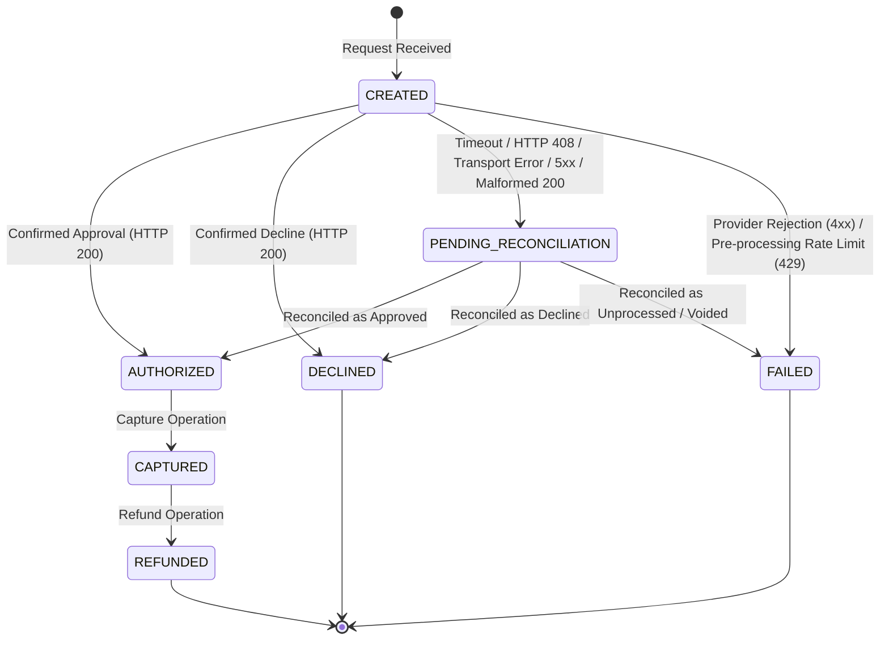

# Transaction Reliability Platform

A small educational and reference implementation demonstrating reliable payment-authorization orchestration, explicit ambiguous-outcome handling, and strict domain state integrity under external network failures.

This project is an architectural reference exploring how distributed systems handle network timeouts, non-deterministic transport failures, and provider boundaries. It is **not** production-ready, PCI-DSS compliant, or fully event-driven.

---

## Current Architecture

The platform follows a ports-and-adapters (hexagonal) architecture separating HTTP transport boundaries from core business logic:



---

## Implemented Features

* **Framework-Independent Transaction State Machine**: Pure standard-library domain entity enforcing discrete states (`CREATED`, `AUTHORIZED`, `DECLINED`, `CAPTURED`, `REFUNDED`, `PENDING_RECONCILIATION`, `FAILED`) and version tracking without database or framework dependencies.
* **Explicit `PENDING_RECONCILIATION` State**: Pairs ambiguous outcomes with matching typed pending operations (`AUTHORIZATION`, `CAPTURE`, `REFUND`), making ambiguous outcomes explicit so a future persistence and idempotency layer can prevent unsafe retries.
* **Typed Domain Exceptions & Invariants**: Enforces transition rules, terminal states, and non-empty identifier validations with typed domain errors.
* **Deterministic Payment-Network Emulator**: Isolated FastAPI service simulating approved, declined, timed-out, malformed, and rate-limited gateway responses.
* **FastAPI Transaction API**: Dedicated endpoint (`POST /v1/transactions`) orchestrating synthetic authorization requests with correlation-ID validation and propagation.
* **Ports-and-Adapters Separation**: Application service orchestrates domain entities against an abstract `PaymentNetworkPort` protocol without coupling to HTTPX or network transports.
* **Defensive HTTPX Secondary Adapter**: Translates downstream HTTP and transport outcomes into typed domain results without leaking client exceptions.
* **Sanitized RFC 7807 Problem Details**: Maps validation, rate-limiting, downstream-rejection, and missing-header errors into structured problem responses without echoing sensitive fields or raw tokens.
* **Synthetic Token-Only Boundary**: Accepts exclusively synthetic test tokens (`tok_test_*`); strictly rejects cardholder data (`pan`, `cvv`, `card_number`) and unknown fields.
* **Defensive Failure Handling**: Handles timeouts, transport disconnects, malformed HTTP 200 responses, HTTP 408, HTTP 429, 4xx rejections, and 5xx upstream errors.
* **Comprehensive Test Suite**: 276 passing automated tests covering state machine transitions, emulator contracts, adapter error mapping, and end-to-end in-process integration via `httpx.ASGITransport`.
* **Strict Quality Gates**: Full verification under Ruff and strict Mypy (`mypy src`).

---

## Scenario Handling & Response Contracts

The transaction service maps downstream outcomes into domain states and HTTP responses:

| Token | Emulator response | Transaction API response | Domain state |
| :--- | :--- | :--- | :--- |
| `tok_test_approved` | HTTP 200 authorized result | HTTP 201 | `AUTHORIZED` |
| `tok_test_declined` | HTTP 200 declined business result | HTTP 201 | `DECLINED` |
| `tok_test_timeout` | Delayed successful response; client timeout makes the outcome ambiguous | HTTP 202 | `PENDING_RECONCILIATION` |
| `tok_test_malformed` | HTTP 200 with deliberately invalid JSON | HTTP 202 | `PENDING_RECONCILIATION` |
| `tok_test_rate_limited` | HTTP 429 with `Retry-After` | HTTP 503 | `FAILED` |

### Key Failure Boundary Behaviors:
* **Ambiguous Timeouts (HTTP 408 & Socket Timeouts)**: Upstream HTTP 408 and read/connect timeouts represent unknown outcomes; the transaction enters `PENDING_RECONCILIATION` (HTTP 202).
* **Transport Errors & HTTP 5xx**: Network transport errors (`httpx.TransportError`) and server errors (HTTP 5xx) conservatively transition to `PENDING_RECONCILIATION` (HTTP 202).
* **Explicit Provider Rejections (HTTP 4xx)**: Under the current emulator contract, non-408 and non-429 client errors (for example, 400 and 422) are treated as explicit request rejection; the transaction transitions to `FAILED` and returns HTTP 502 without exposing provider internals.
* **Rate Limiting (HTTP 429)**: Under the emulator contract, HTTP 429 guarantees the request was rejected at the gateway before authorization processing began; the transaction transitions to `FAILED` and returns HTTP 503 with a sanitized `Retry-After` header.

---

## Transaction Lifecycle State Machine



*Note: Capture and refund transitions are fully enforced in the domain entity; their external API endpoints will be added in subsequent milestones.*

---

## Current Limitations

* **No Persistence**: Transactions exist only for the duration of a request and are discarded after the response; there is currently no transaction repository.
* **No Idempotency-Key Storage**: Idempotency keys are not yet stored or enforced across duplicate requests.
* **No Asynchronous Reconciliation**: Transactions in `PENDING_RECONCILIATION` cannot yet be polled or resolved out-of-band by a background worker.
* **No Distributed Infrastructure**: No PostgreSQL, Kafka, transactional outbox, Redis, or Docker deployment.
* **No Authentication**: Endpoints do not require API tokens or mTLS.
* **Synthetic Data Only**: Accepts only `tok_test_*` synthetic tokens; no live payment processing or banking integration.
* **No PCI-DSS Compliance Claim**: Demonstrates data-minimization boundaries but makes no formal PCI-DSS compliance claims.

---

## Planned Future Milestones

1. **Durable Persistence & Idempotency**: PostgreSQL and SQLAlchemy persistence with atomic idempotency key reservations and payload validation.
2. **Transactional Outbox & Event Publishing**: Reliable event streaming via Kafka for transaction status changes.
3. **Asynchronous Reconciliation Worker**: Background daemon resolving `PENDING_RECONCILIATION` transactions via provider polling.
4. **Capture & Refund API Endpoints**: Expanding API orchestration to post-authorization lifecycles.
5. **Observability**: Structured metrics (Prometheus) and distributed tracing (OpenTelemetry).

---

## Developer Instructions

### Prerequisites
* Python 3.12+

### 1. Environment Setup
```bash
# Create and activate a Python 3.12 virtual environment
python3.12 -m venv .venv
source .venv/bin/activate

# Install package in editable mode with development dependencies
python -m pip install -e ".[dev]"
```

### 2. Running the Services
Start each service in a separate terminal:

```bash
# Terminal 1: Payment Network Emulator (:8001)
uvicorn transaction_platform.emulator.app:app --port 8001

# Terminal 2: Transaction API (:8000)
uvicorn transaction_platform.api.app:app --port 8000
```

Service URLs and liveness health checks:
* **Transaction API**: `http://localhost:8000` (Liveness: `http://localhost:8000/health/live`)
* **Payment Network Emulator**: `http://localhost:8001` (Liveness: `http://localhost:8001/health/live`)

### 3. Send a Sample Authorization Request
```bash
curl -i -X POST http://localhost:8000/v1/transactions \
  -H "Content-Type: application/json" \
  -H "X-Correlation-ID: corr_sample_001" \
  -d '{
    "transaction_id": "txn_sample_001",
    "merchant_id": "merchant_101",
    "payment_token": "tok_test_approved",
    "amount": 2500,
    "currency": "USD"
  }'
```

### 4. Running Verification
```bash
pytest          # Run test suite (276 tests)
ruff check .    # Run linting and style checks
mypy src        # Run strict static type checks
```

---

## AI Disclosure

AI tools assisted with scaffolding, implementation suggestions, test generation, and review. Architecture decisions, acceptance criteria, validation, and code ownership remain with the author.
