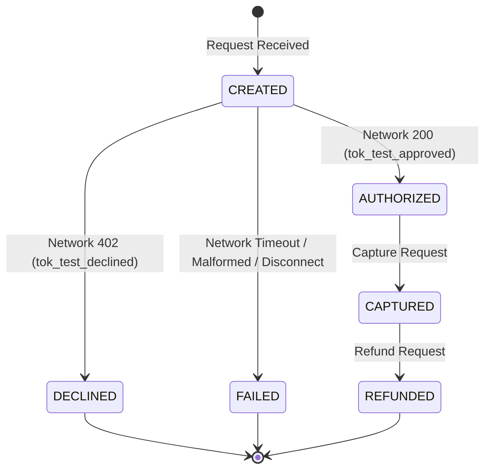

# Transaction Reliability and Event Processing Platform

A production-style reference implementation exploring reliability and data-protection patterns common to event-driven transaction systems. It demonstrates idempotent request processing, sensitive-data tokenization boundaries, transactional state integrity, and failure recovery under downstream network ambiguity.

---

## 1. The Problem

In financial and mission-critical transactional systems (e.g., payments, reservations, order checkouts), transient network timeouts and client-side retries frequently cause duplicate submissions. 

When a downstream payment network or external service takes longer to respond than the client's HTTP timeout, the client assumes the request failed and immediately retries. If the backend cannot guarantee atomic idempotency and concurrency serialization, the customer can be charged twice, or the system can enter an irrecoverable split-brain state.

---

## 2. System Boundary (Version 0.1 Scope)

Version 0.1 focuses strictly on core transactional correctness, idempotency under concurrent retries, and network failure emulation:

```
[ Client / API Consumer ]
            │
            ▼ (HTTPS + Idempotency-Key + Correlation-ID)
[ FastAPI Transaction Service ] ◄──► [ PostgreSQL ]
            │
            ▼ (HTTP / Internal Protocol)
[ Payment Network Emulator ]
```

---

## 3. Version 0.1 Guarantees

* **Idempotent Replay**: Replaying the exact same idempotency key and payload returns the cached result (`Idempotent-Replay: true`).
* **Payload Mismatch Conflict**: Submitting an existing idempotency key with a different request body returns `HTTP 409 Conflict`.
* **Concurrent Duplicate Protection**: Simultaneous requests using the same key create only one transaction; duplicate in-flight calls are serialized or rejected cleanly.
* **Domain State Machine Integrity**: Invalid lifecycle transitions are strictly rejected.
* **Synthetic Token Whitelist**: Only deterministic synthetic test tokens (`tok_test_*`) are accepted.
* **Zero CVV Persistence**: CVV is validated transiently in-memory and immediately discarded—never persisted to database tables, disk, logs, or error traces.

---

## 4. What is Deliberately Excluded from Version 0.1

To maintain a disciplined, auditable release boundary, the following are intentionally deferred to future milestones:
* **Real Payment Processing**: No connection to live banking or card networks.
* **PCI-DSS Compliance**: Demonstrates architectural boundaries, not production vault key management or HSMs.
* **Production Key Management**: Cryptographic keys are loaded from local environment configurations for development.
* **Exactly-Once Delivery**: The system relies on eventual at-least-once semantics paired with idempotent consumers.
* **Asynchronous Outbox & Kafka**: Deferred to Version 0.2.
* **Observability Dashboards (Prometheus/Grafana)**: Deferred to Version 0.3.
* **AI-Assisted Test Scenario Generation**: Deferred to Version 0.4.

---

## 5. Transaction Lifecycle

The transaction state machine governs the lifecycle of every transaction:



All other transitions (e.g., attempting to refund an uncaptured transaction, or capturing a declined authorization) are illegal and rejected with domain errors.

---

## 6. Expected Failure Behavior

| Synthetic Token | Downstream Emulator Behavior | API Service Response | Transaction State |
| :--- | :--- | :--- | :--- |
| `tok_test_approved` | Returns `200 OK` | `201 Created` | `AUTHORIZED` |
| `tok_test_declined` | Returns `402 Payment Required` | `402 Payment Required` | `DECLINED` |
| `tok_test_timeout` | Socket / Read timeout | `504 Gateway Timeout` | `FAILED` |
| `tok_test_rate_limited` | Returns `429 Too Many Requests` | `502 Bad Gateway` (Rate Limited) | `FAILED` |
| `tok_test_disconnect` | Drops connection after processing | `502 Bad Gateway` (Connection Dropped) | `FAILED` (Pending Reconciliation) |

---

## 7. AI-Assisted Development

AI coding tools were used for scaffolding, implementation suggestions, test-case generation, and code review. Architecture decisions, acceptance criteria, security boundaries, verification, and final code ownership remain with the project author. AI-generated changes are reviewed and validated through deterministic automated tests.
