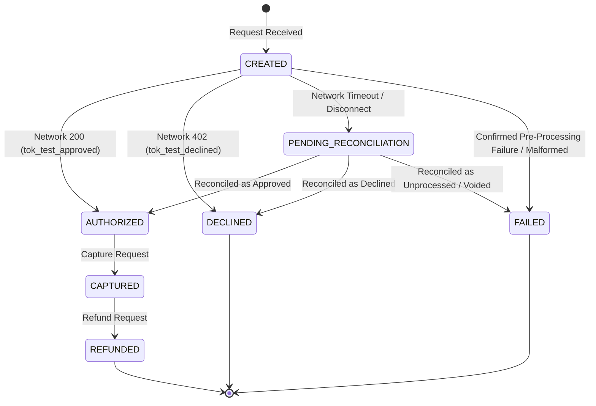

# Transaction Reliability and Event Processing Platform

A production-style reference implementation exploring reliability and data-protection patterns common to event-driven transaction systems. It demonstrates idempotent request processing, token-only payment boundaries, transactional state integrity, and recovery from ambiguous downstream outcomes.

---

## 1. The Problem

In financial and mission-critical transactional systems (e.g., payments, reservations, order checkouts), transient network timeouts and client-side retries frequently cause duplicate submissions.

When a downstream payment network or external service takes longer to respond than the client's HTTP timeout, the client assumes the request failed and immediately retries. If the backend cannot guarantee atomic idempotency and concurrency serialization, the customer can be charged twice, or the platform can develop inconsistent transaction records and ambiguous downstream outcomes.

Crucially, **a downstream timeout or connection drop must not automatically mark a transaction as `FAILED`**. If an external network processed the authorization but the response packet was dropped in transit, marking the transaction `FAILED` would allow an unsafe retry that creates a duplicate charge. The platform must explicitly model ambiguous external outcomes via a `PENDING_RECONCILIATION` state.

---

## 2. System Boundary (Version 0.1 Scope)

Version 0.1 focuses strictly on core transactional correctness, idempotency under concurrent retries, and network failure emulation:

```
[ Client / API Consumer ]
            │
            ▼ (HTTPS + Idempotency-Key + Correlation-ID)
[ FastAPI Transaction Service ] ◄──► [ PostgreSQL ]
            │
            ▼ (HTTP / Internal Protocol)
[ Payment Network Emulator ]
```

---

## 3. Version 0.1 Guarantees

* **Idempotent Replay**: Replaying the exact same idempotency key and payload returns the cached result (`Idempotent-Replay: true`). Idempotency records cache declined business outcomes as well as approvals.
* **Payload Mismatch Conflict**: Submitting an existing idempotency key with a different request body returns `HTTP 409 Conflict`.
* **Concurrent Duplicate Protection**: Simultaneous requests using the same key create only one transaction; duplicate in-flight calls are serialized or rejected cleanly.
* **Domain State Machine Integrity**: Invalid lifecycle transitions are strictly rejected.
* **Ambiguous Outcome Isolation**: Downstream timeouts and disconnects transition transactions to `PENDING_RECONCILIATION`, preventing unsafe automatic retries until the true network state is determined.
* **Token-Only Boundary**: The API accepts only predefined synthetic payment tokens (`tok_test_*`). PAN, CVV, and real cardholder data are rejected and never processed, persisted, or logged.

---

## 4. What is Deliberately Excluded from Version 0.1

To maintain a disciplined, auditable release boundary, the following are intentionally deferred to future milestones:
* **Real Payment Processing**: No connection to live banking or card networks.
* **PCI-DSS Compliance**: Demonstrates architectural boundaries, not production vault key management or HSMs.
* **Production Key Management**: Cryptographic keys are loaded from local environment configurations for development.
* **Exactly-Once Delivery**: The system relies on eventual at-least-once semantics paired with idempotent consumers.
* **Asynchronous Outbox & Kafka**: Deferred to Version 0.2.
* **Observability Dashboards (Prometheus/Grafana)**: Deferred to Version 0.3.
* **AI-Assisted Test Scenario Generation**: Deferred to Version 0.4.

---

## 5. Transaction Lifecycle

The transaction state machine governs the lifecycle of every transaction:



All other transitions (e.g., attempting to refund an uncaptured transaction, or capturing a declined authorization) are illegal and rejected with typed domain exceptions.

---

## 6. Expected Failure Behavior & Response Contract

We adopt a **transport-oriented API contract** (distinguishing successful API ingestion from a negative business outcome like a card decline):

| Synthetic Token | Downstream Emulator Behavior | API Response | State |
| :--- | :--- | :--- | :--- |
| `tok_test_approved` | Returns `200 OK` (Auth successful) | `201 Created` (`status: AUTHORIZED`) | `AUTHORIZED` |
| `tok_test_declined` | Returns `402 Payment Required` (Insufficient funds) | `201 Created` (`status: DECLINED`) | `DECLINED` |
| `tok_test_timeout` | Socket / Read timeout (Result unknown) | `504 Gateway Timeout` | `PENDING_RECONCILIATION` |
| `tok_test_disconnect` | Processes auth and drops connection | `502 Bad Gateway` | `PENDING_RECONCILIATION` |
| `tok_test_rate_limited` | Returns `429 Too Many Requests` (Upstream throttled) | `503 Service Unavailable` | `FAILED` |
| `tok_test_malformed` | Returns invalid / unparseable payload | `502 Bad Gateway` | `FAILED` |

*Note: In `PENDING_RECONCILIATION`, the transaction record is safely preserved with its idempotency key. Subsequent retries using the same idempotency key will acknowledge the in-flight reconciliation rather than spawning a duplicate charge.*

---

## 7. AI-Assisted Development

AI coding tools were used for scaffolding, implementation suggestions, test-case generation, and code review. Architecture decisions, acceptance criteria, security boundaries, verification, and final code ownership remain with the project author. AI-generated changes are reviewed and validated through deterministic automated tests.
